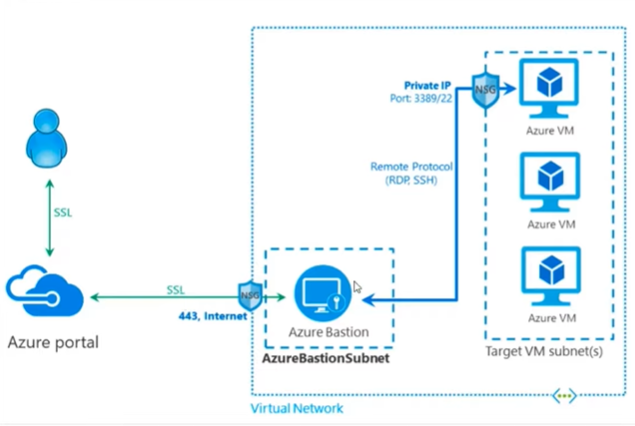
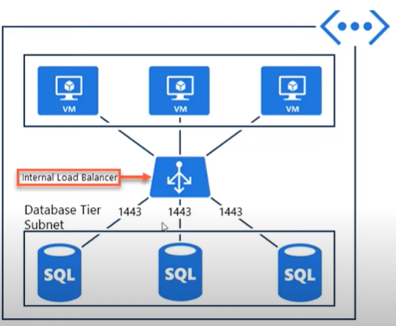

# Azure Networking

## Sources

https://www.youtube.com/watch?v=feQvnIUJ3Iw&ab_channel=K21Academy

https://www.youtube.com/watch?v=9DuTWSvsLXM&list=PLlVtbbG169nGccbp8VSpAozu3w9xSQJoY&index=7&ab_channel=JohnSavill%27sTechnicalTraining

## Virtual Networks Overview

### Fundamentals
- Basics
  - IPv4 
    - X.X.X.X, each X can be 0 to 255
    - Classes
        - A: 0 - 126
        - B: 128 - 191
        - C: 192 - 223
        - D: 224 - 239
        - E: 240 - 255
        - 127 - Loopback
    - CIDR: Classless Interdomain Routing
      - X.X.X.X/YY
      - Bigger masks leave space for less IPs in the network
    - Public vs Private
      - Public
            - Microsoft gets their public IPs from IANA
            - Public IPs are generally used for management
      - Private:
        - Generally used for data traffic
        - Private Ranges:
            - 10.0.0.0 - 10.255.255.255
            - 172.16.0.0 - 172.31.255.255
            - 192.168.0.0 - 192.168.255.255
            - Addresses can be used once per subscription in Azure
#### Virtual Networks
  - Rule of Thumb: Everyone in the vnet can talk to everyone in the vnet
    - To remedy this, the vnet can be limited to subnets
  - Azure restricts the use of addresses 0, 1, 2, 3 and 255 for subnets
    - 0: Network Identifier
    - 1, 2, 3: Reserved by Azure
    - 255: Broadcast ID
  - Limit of vnets per Azure subscription
    - soft: 50 vnets
      - Once the number reaches this, anyone can call Microsoft to increase their limit to 500
    - hard: 500 vnets
- Virtual Networks can connect to either other virtual networks or on-premises networks

#### Virtual Network Security
- Shared Responsibility: Microsoft does some things, but the customers also have to enforce security on their side
- Vnet perimeter security:
  - DDoS
  - Firewall (firewall as a service)
    - Expensive
    - Access Control Lists (ACL) can be setup to allow or deny certain sites

### IP Addresses
- Public: Can be accesses directly from anywhere
- Private: Can only be accessed directly if you're connected to the vnet
- Dynamic: The IP itself isn't guaranteed to remain the same
  - Example: Virtual Machines
- Static: The IP will always be the same

### Route Tables
- Use cases:
  - Application in vnet1 needs to access some resource outside of the network, some on premises application or something in vnet2
- Route tables help with connections outside the current vnet
- Rules allow the redirection of traffic from certain IP ranges to other types of resources (next hop types)
- Route tables need to be associated to a subnet

### Network Security Group (NSG)
- Sort of a firewall at a network traffic
- Filters traffic coming to and from a network
- Has security rules for ingress (what goes in) and egress (what comes out)
  - Each rule can allow or deny a collection of IPs
- Can be associated with a subnet or a Network Interface Card

### Service Endpoint
- Helps filter traffic to a particular azure service
- Are created in the vnet options
- Creates a definition for a resource inside the vnet

### Application Security Group
- Logical grouping of virtual machines that share common rules
- It's easier to set up than specifying separate routing tables for each virtual machine
- Practice Scenario:
  - WebServer ASG can access only AppServers and be accessed by the internet
  - AppServers ASG can access DbServers and be accessed by WebServers
  - DbServers ASG can only be accessed by AppServers

### Azure Firewall
- Managed cloud-base network security service
- Connectivity policies to protect layers 3 and 7
- Inbound/outbound filtering rules
- Highly scalable
- Threat intelligence
- Also is unusually expensive for an Azure Resource
- 1 firewall per virtual network

#### Firewall Deployment Models
- Secured virtual hub (Azure Virtual WAN Hub)
- Hub virtual network (hub/spoke model using regular VNETs)

#### Azure Firewall Manager
- Centralizes security policies and routing managements for firewalls

### Bastion Hosts
- AKA jumpbox, remote server host
- Usually vms can be connected through 3389 (rdp) or 22 (linux)
  - This tends to be risky if the vms are important
- Bastion is a server that accepts connections over the internet using port 443 (SSL)
- First the user connects to Azure Bastion through the Azure Portal, and it will have the tools to connect to the virtual machines

### NAT Gateway
- NAT - Network Address Translation
- All subnets attached to it use the NAT's public IP instead of the resources' IPs for outbound traffic only
- Fully managed and highly available
- Also works for IP Prefixes
- Associates directly with subnets

### Azure DNS
- DNS - Domain Name Service
  - Resolves hostnames to IP addresses
- When you create a vnet, you can set the vnet's DNS servers

### Azure Load Balancer
- Takes requests from clients and balance them to one of several backend servers in the backend pool
- Distribution strategies (Load Balancing Rules)
  - Round Robin -> cycling through machines
  - Weighted Distribution (50% of traffic to backend X)
  - Client Affinity (same clients always get the same machines)
- Has health probes to determine if everything in the backend is ok
- Works in layer 4 (TCP/UDP) and layer 7 (HTTP)

#### External/Public
- Are exposed to the internet
- Have a public IP
- Can listen to one or more ports (such as 80 and 443)

#### Internal/Private
- Balances traffic only inside a virtual machine
- Can be the only exposed part of a subnet to route traffic to a pool of the same resource (backend servers/databases)

#### Application Gateway
- Works on layer 7 (HTTP/S) only
- When someone makes a request to the app gateway's frontend IP, it will trigger a HTTP/HTTPS listener that will route the request to one of several backends in the backend pool, based on the HTTP Settings
  - Backends can be Web Apps, VM, VMSS, On Premise Servers, Kubernetes
- Supports bath based routing
- Also support multiple-site routing
- Has a Web Application Firewall and a Layer 7 Load Balancer

### Azure Traffic Manager
- Used to determine what is the best possible endpoint to route a client request
- Can be set up to use one of several routing methods
- Difference from load balancer is that the traffic manager redirects the user directly to the endpoint, instead of proxying the connection
- Can be used to redirect to load balancers for ultra-high-availability
- Also has health checks
- Routing Methods
  - Weighted
  - Performance (Which endpoint has the fastest response)
  - Geographic

### Connecting Cloud to On Premises

#### Express Route
- Stablishes a direct connection from Microsoft's Network to the Customer's Network through a dedicated pipe
  - Direct connection meaning it doesn't go through the internet
- ExpressRoute Circuit - 2 pipes between cloud and on prem networks, one primary and one secondary
- Microsoft Edge (not the browser): Links to either a vnet (using Azure Private Peering) or to public IPs for other Microsoft Services and servers as a middleman for the traffic between them and the ExpressRoute Circuit
- Very fast
- Expensive
- Components
  - Customer needs a gateway and local edge routers to connect to the Express Route Circuit
  - Azure needs to have an ExpressRoute Gateway

#### VPN Gateway
- Data goes through the internet, so is an indirect connection
  - Instead of a direct pipe, data goes through an IPsec/IKE (IKEv1 or IKEv2) VPN Tunnel
- Can't guarantee a super fast connection
- One end of the gateway will talk to Azure and the other end will talk to an on premises VPN device through the tunnel
- The VPN Gateway itself needs to exist in a separate subnet, created as a Gateway Subnet instead of a regular one

##### Site to Site (S2S)
- Connects Azure to an on premises network, with multiple devices
- Implementing S2S:
  1. Create vnets and subnets
  2. Create the gateway subnet
  3. Create the VPN gateway in the gateway subnet
  4. Set up the VPN device on premises
  5. Create the local network Gateway with the data from the VPN device
  6. Create the VPN connection in Azure

##### Local Network Gateway
- Virtual representation of an on premises VPN device
- On premises device needs to have a public IP to talk to the VPN Gateway
- Used to set up a site to site VPN connection

##### Point to Site (P2S)
- Someone can install a VPN client to configure a VPN tunnel between Azure (site) and their machine (point)

#### Virtual WAN
- WAN = Wide Area Connection
- If you have a lot of vnets and a lot of on premises networks, a Virtual WAN can connect all the VNets to all on premises networks
- This only requires you to set up the VPN Gateway once

### Vnet Peering
- All vnets are available only on a specific region
- If you have machines in 2 different regions you'll need to create 2 different vnets
- Inside the same vnet, devices can connect through their private IPs
- If a device from Vnet 1 wants to talk with a device from Vnet 2 using a private IP, that's when **peering** the virtual networks is useful
- Peering: connecting 2 virtual networks, can be either 2 vnets in the same region (regional peering) or in different regions (global peering)
- To peer vnets, go to the Virtual Network resource, tab "Peerings"

## Hub and Spoke Model
- Architecture pattern for creating networks
- One central Hub network that centralizes common components for networking such as Firewall, Bastion, VPN Gateways and Monitoring and only has what should be common for other networks
- Networks that actually have stuff in them are called Spoke networks and they are peered to the Hub network to also take advantage of what's configured in there
- This way we don't need to create one firewall for each network, for example

### Gateway Transit
- Property that can be set in virtual network peering that allows devices in an on premises network direct access to devices in a spoke network using private IPs
- The only way for VPN Gateway to work in the hub and spoke model

## Doubts
- What is the Propagate Gateway Routes option when creating a route table?
- How can service endpoints be accessed in practice?
- Are ASGs useful only for virtual machines?
- Is Web Application Firewall only available for application gateways?